# Merge Balls Box

Arcade merge puzzle game made in Unity.

Balls with different images spawn above a box, and the player drops them inside. When two identical balls touch each other, they merge into a larger ball with a new image.

The goal is to create as many merges as possible and unlock bigger ball evolutions before the box fills up to the top border.

The game ends when the balls reach the upper limit of the box.

---

## Gameplay Preview


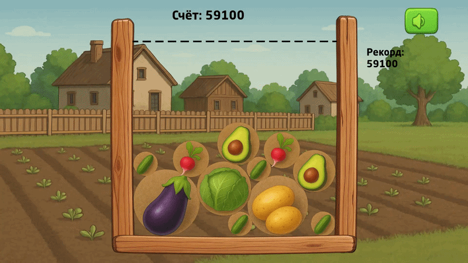


---

## Screenshots

<p align="center">
  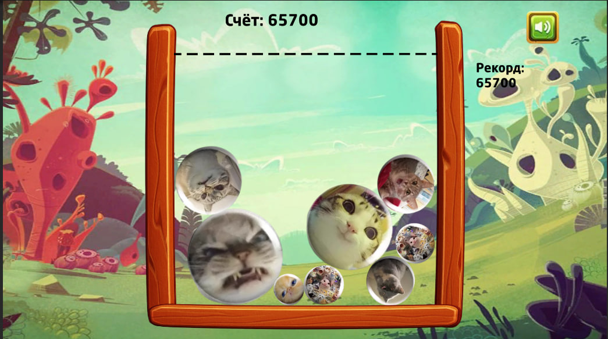
  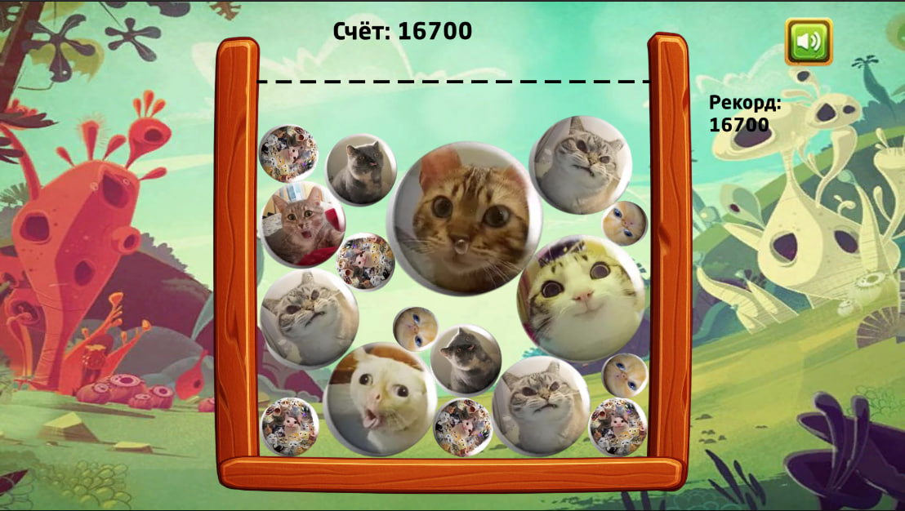
  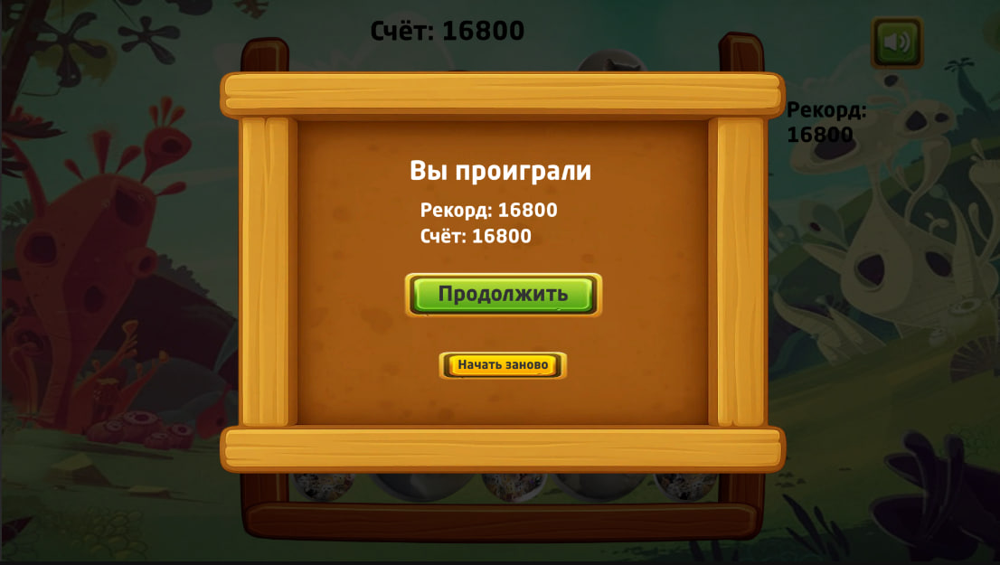
</p>
<p align="center">
  
  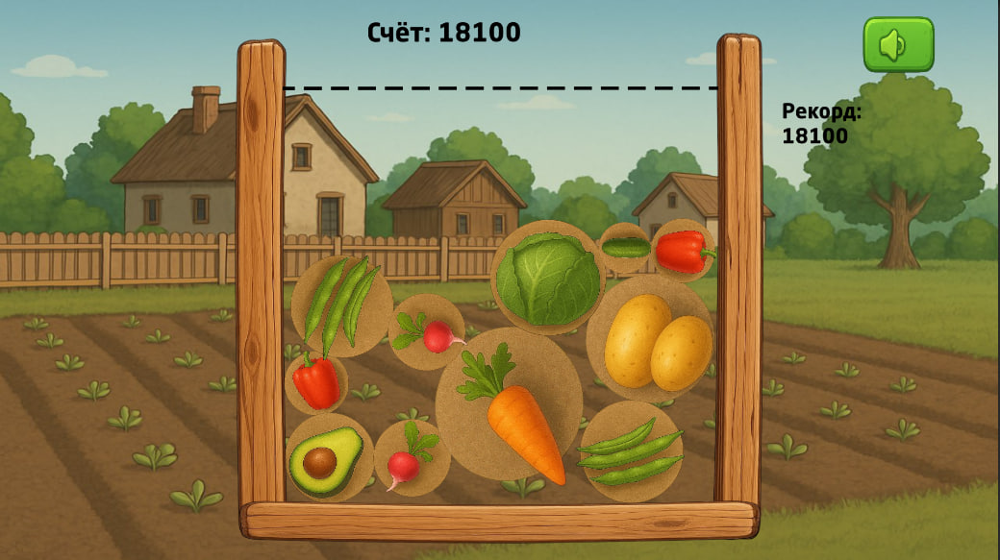
  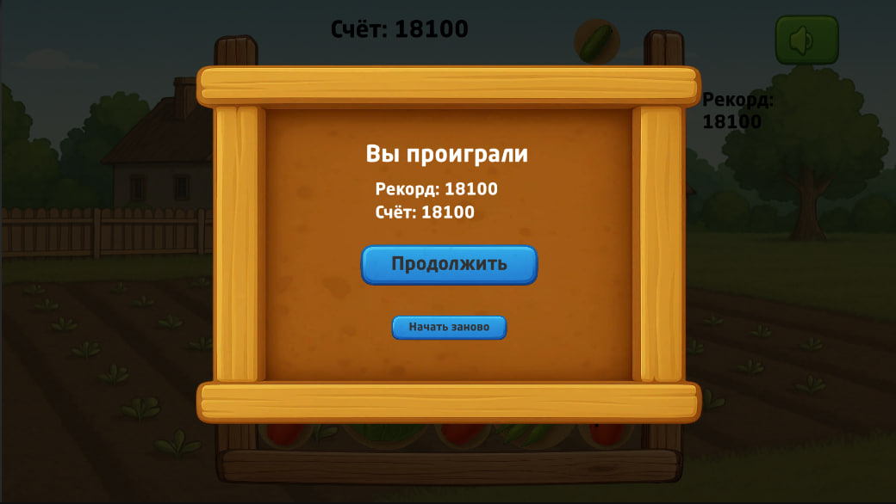
</p>
<p align="center">
  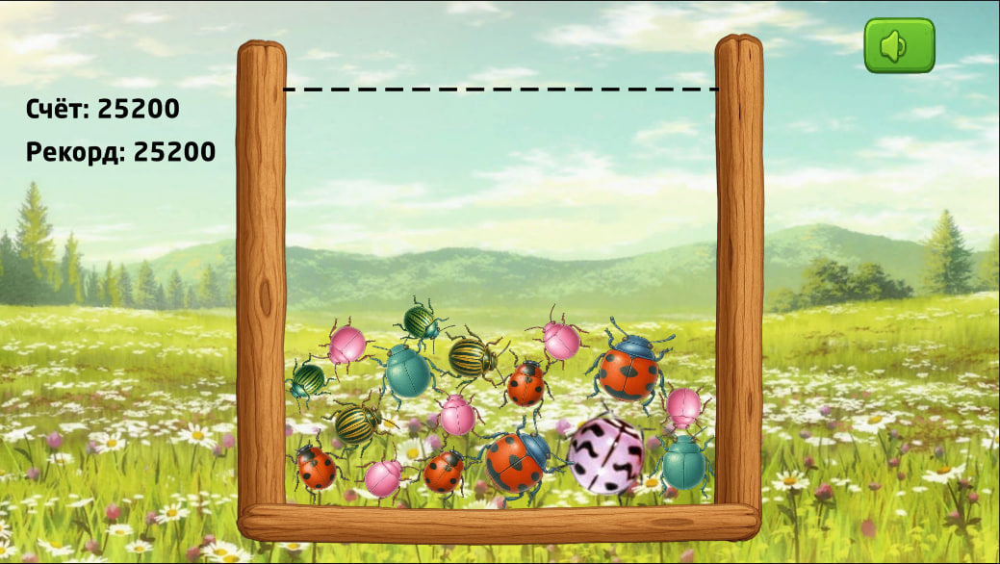
  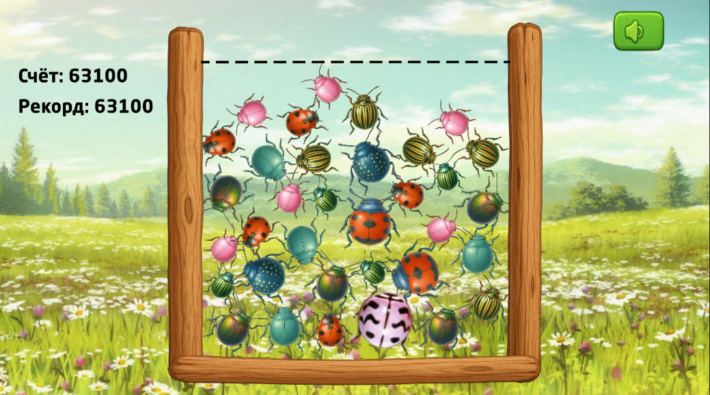
  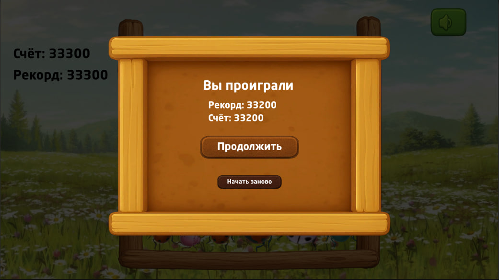
</p>
<p align="center">
  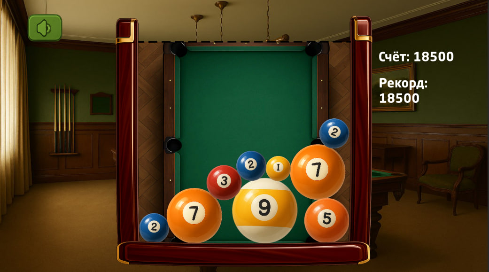
  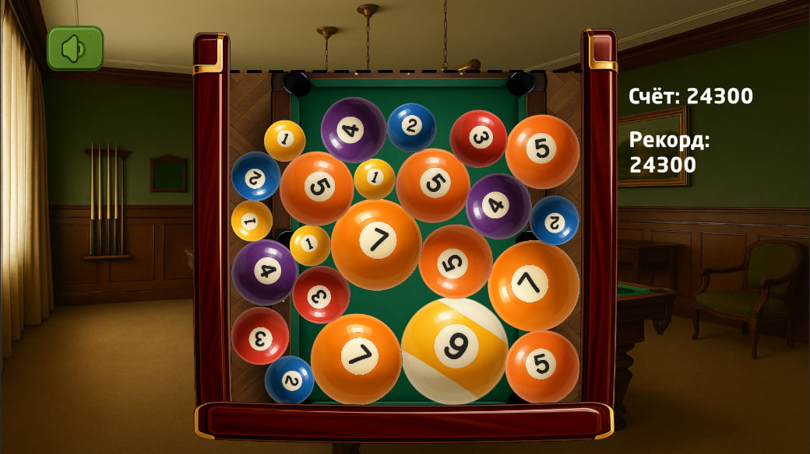
  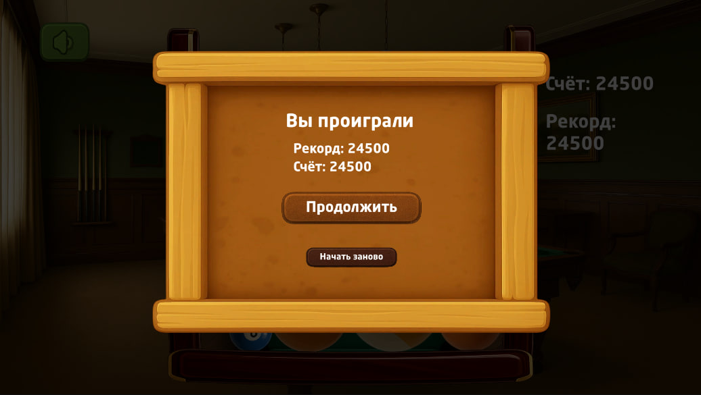
</p>

---

## Gameplay Features

- Physics-based ball dropping
- Merge mechanics
- Progressive ball evolution system
- Image-based ball variations
- Increasing difficulty over time
- Endless high-score gameplay

## AI-Assisted Content System

This project uses AI-assisted automation for game content creation:

- Automatic generation and replacement of ball images
- AI-based sound effect variations
- Fast iteration of visual and audio assets

This approach allows rapid content updates and experimentation with different styles, significantly reducing manual production time for assets.

## How to Play

1. Move the ball horizontally.
2. Drop it into the box.
3. Merge identical balls on contact.
4. Create higher-level balls with new visuals.
5. Prevent the box from overflowing.

## Controls

- **Mouse** — Move ball
- **Left Mouse Button** — Drop ball

## Built With

- Unity
- C#
- AI-assisted asset pipeline

## Project Structure

```text
Assets/
Packages/
ProjectSettings/
